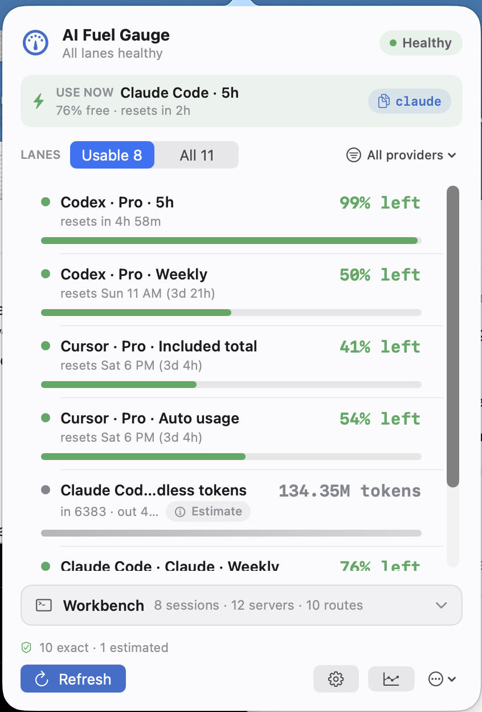

# AI Fuel Gauge

[](https://github.com/ozansozuozgit/aifuelgauge/actions/workflows/release.yml)
[](#install)
[](Package.swift)
[](LICENSE)

AI Fuel Gauge is a local-first macOS menu bar app for people who live inside AI
coding tools. It answers the practical question:

> Which AI lane can I use right now without running into a limit?

It watches Codex, Cursor, Claude Code, OpenRouter, OpenAI, and local agent usage
signals, then turns them into a compact menu-bar status and a fast popover built
for scanning.

<!--
Add the screenshot at docs/assets/ai-fuel-gauge-popover.png, then uncomment this
block before publishing a visual README.

<p align="center">
  
</p>
-->

## Why

Provider dashboards are scattered, quota labels are inconsistent, and local
coding agents often expose just enough metadata to be useful but not enough to
trust blindly. AI Fuel Gauge keeps those differences visible instead of hiding
them behind a fake universal score.

The app is designed around three ideas:

- Show the lane that matters now, directly in the menu bar.
- Keep exact provider data separate from local estimates and unknown sources.
- Make the popover useful in seconds, not after opening five dashboards.

## What It Does

- Adaptive menu-bar label with the tightest useful lane, remaining capacity, and
  reset time.
- Primary usage gauge for the current lane to watch.
- Usable and all-lanes filters so exhausted or noisy rows do not dominate the
  default view.
- Next-reset strip for the quota windows that matter soonest.
- Most-room and tightest-lane guidance so you can choose the right tool for the
  next task.
- Plan labels for Codex, Cursor, and Claude Code, with local overrides where a
  provider does not expose a clean plan name.
- Local 7-day trend history, sparklines, peaks, deltas, and CSV export.
- Pace and spike warnings when recent usage makes a limit likely.
- Agent Workbench context for recent Claude Code and Codex sessions, common
  local agent routes, and localhost dev servers.
- Copyable status summaries and diagnostics that avoid secrets.
- Local `status.json` export for WidgetKit, SketchyBar, Raycast, Ubersicht, or
  any other status surface that wants a simple machine-readable snapshot.
- Settings for provider toggles, refresh cadence, warning thresholds, menu-bar
  display mode, budgets, keys, and start-at-login.

## Supported Sources

| Source | What it can show | Confidence |
| --- | --- | --- |
| Codex account | 5h and weekly quota windows, plan labels, model-specific caps | Exact when the local Codex account token is available |
| Cursor account | Included usage, auto usage, API usage, spend rows, plan/status hints | Exact when local Cursor auth is available |
| Claude Code | 5h and weekly quota windows via statusline capture; local token aggregation as fallback | Exact after statusline capture, estimated from JSONL fallback |
| OpenRouter | Key usage and account credits | Exact with a saved API key |
| OpenAI | Organization costs and completions usage | Exact with a saved Admin key |
| OpenCode | Local SQLite token aggregation | Estimated |

Exact means the app is reading a provider/account endpoint or documented local
account state. Estimated means the app is aggregating local usage metadata.
Unknown means the source is detected but the app cannot safely turn it into a
quota or usage row.

## Privacy Model

AI Fuel Gauge is local-first.

- API keys are stored in macOS Keychain.
- Cursor and Codex auth are read from local account state when available.
- Claude Code, Codex fallback, and OpenCode usage are aggregated from local
  metadata files.
- Prompt text is not read for status summaries.
- The Agent Workbench uses file names, modification times, paths, process names,
  ports, and file sizes. It does not surface prompt or transcript text.
- Copied diagnostics and `status.json` are sanitized.
- The app does not send a central telemetry feed.

The important boundary: some providers expose exact account usage, while local
logs can only estimate activity. The UI keeps those labels visible so you know
what to trust.

## Install

AI Fuel Gauge requires macOS 14 or newer.

### Homebrew

```bash
brew install --cask https://raw.githubusercontent.com/ozansozuozgit/aifuelgauge/main/Casks/ai-fuel-gauge.rb
```

Open **AI Fuel Gauge** from Applications after installing.

### From Source

```bash
git clone https://github.com/ozansozuozgit/aifuelgauge.git
cd aifuelgauge
make install
```

`make install` builds a release app, copies it to:

```text
~/Applications/AI Fuel Gauge.app
```

It also installs and starts this LaunchAgent:

```text
~/Library/LaunchAgents/com.ozansozuoz.aifuelgauge.plist
```

Uninstall:

```bash
make uninstall
```

Package without installing:

```bash
make package
open dist
```

## Configure

Most setup happens in the popover Settings screen.

- Save OpenRouter and OpenAI keys only after the app successfully tests them.
- Enable or disable providers you do not want polled.
- Set local plan labels for sources that do not expose a reliable plan name.
- Add optional monthly budgets for spend rows such as OpenAI, Cursor, or
  OpenRouter so they can become comparable warning lanes.
- Choose how much detail the menu bar should show: detail, pair, sparkline,
  compact, or minimal.
- Turn start-at-login on or off without touching the terminal.

### Claude Code exact usage

Claude Code has two different local signals:

- Local JSONL usage files in `~/.claude/projects`, which provide token totals
  but not official quota percentages. AI Fuel Gauge labels these rows as
  estimated.
- `claude -p`, SDK, queued, and Hermes-style headless runs usually land only in
  those local JSONL files. AI Fuel Gauge labels them as
  `print/headless tokens` when the logs identify that mode. They are useful for
  understanding local token volume, but they are not official 5h or weekly quota
  usage.
- Claude Code statusline `rate_limits`, which can expose exact 5h and weekly
  usage percentages and reset times for Pro/Max accounts after Claude Code
  receives an assistant response.

Use **Settings -> Enable Claude exact usage** to install:

```text
~/.claude/aifuelgauge-statusline.py
```

The installer updates:

```text
~/.claude/settings.json
```

and writes captured quota data to:

```text
~/Library/Application Support/AI Fuel Gauge/claude-statusline.json
```

The statusline script stores only the documented quota fields, reset times,
session id, model name, and update timestamp. It does not store prompt text.

If Claude still shows only a token row after enabling exact usage, run or
continue a **Claude Code** session and wait for one assistant response, then
refresh AI Fuel Gauge. Opening Claude Desktop or the Claude account Usage page
does not trigger Claude Code statusline data.

When the script is installed but no statusline payload has arrived yet, the
Claude row remains visible as `Claude Code · Max 5x` with local token totals and
an explanation that exact capture is waiting for Claude Code. Once the first
payload arrives, AI Fuel Gauge adds exact `5h` and `Weekly` Claude rows with
meters and reset times.

## Status Export

Every refresh writes a sanitized machine-readable snapshot:

```text
~/Library/Application Support/AI Fuel Gauge/status.json
```

It includes the menu title, state, primary lane, next resets, visible lanes,
setup guidance, and trend samples. It does not include API keys, auth tokens,
prompt text, or raw provider responses.

## Agent Workbench

The popover includes a compact local workbench beside the usage lanes:

- Recent Claude Code and Codex session files, ordered by local modification time.
- Quick routes for agent skills, plugins, config, logs, and local app state.
- Localhost dev servers on ports 3000-9999, with open, copy URL, and stop
  actions.

This is intentionally passive. AI Fuel Gauge does not install permission hooks
or take over agent prompts; it keeps nearby context visible so quota decisions
are easier while the usage meter remains the main product surface.

## Development

Run tests:

```bash
swift test
```

Run the app locally:

```bash
scripts/dev-run.sh
```

The helper script stops any stale debug build from this repo before launching
the fresh one. The same commands are available through `make`:

```bash
make test
make run
make package
make release-zip
```

SwiftPM package layout:

```text
Sources/AIFuelGaugeApp      Native AppKit/SwiftUI menu bar app
Sources/AIFuelGaugeCore     Connectors, budgeting, history, view models
Tests/AIFuelGaugeCoreTests  Parser, connector, dashboard, packaging tests
scripts                    Packaging, install, release, and dev helpers
Casks                      Homebrew cask
```

## Release

Push a version tag to build and publish a GitHub release:

```bash
git tag v0.1.0
git push origin v0.1.0
```

The release workflow runs tests on macOS, builds `AI Fuel Gauge.app`, uploads
versioned and stable `AI-Fuel-Gauge-latest.zip` artifacts, and attaches SHA-256
checksums.

If signing and notarization secrets are configured, the workflow signs with
hardened runtime, submits the app to Apple notarization, staples the ticket, and
publishes the notarized zip. Without those secrets, local and CI packaging still
work with ad-hoc signing, though macOS may require first-launch approval in
Privacy & Security.

## Roadmap

- Native WidgetKit companion that reads the local status export.
- Cleaner first-run checklist for connecting Codex, Cursor, OpenRouter, and
  OpenAI.
- More provider-specific explanations for unusual quota windows.
- Better history views for comparing burn rate across tools.
- Optional update flow for Homebrew or GitHub release installs.

## License

MIT. See [LICENSE](LICENSE).
